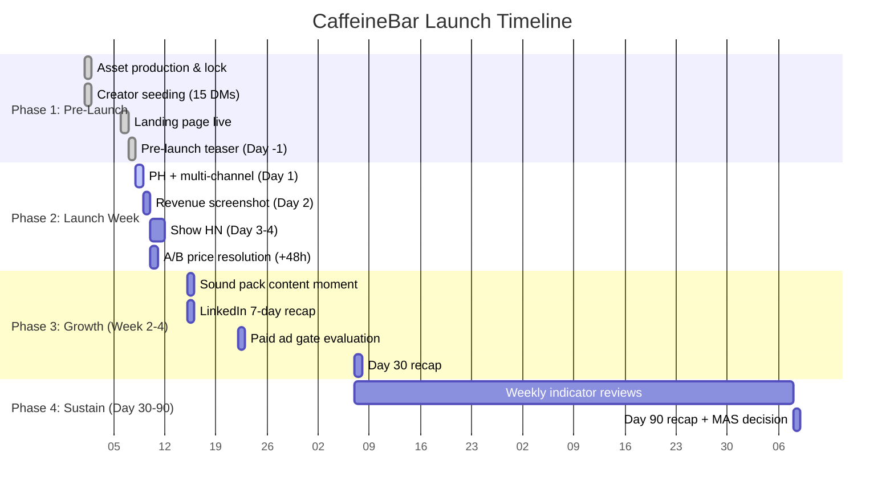
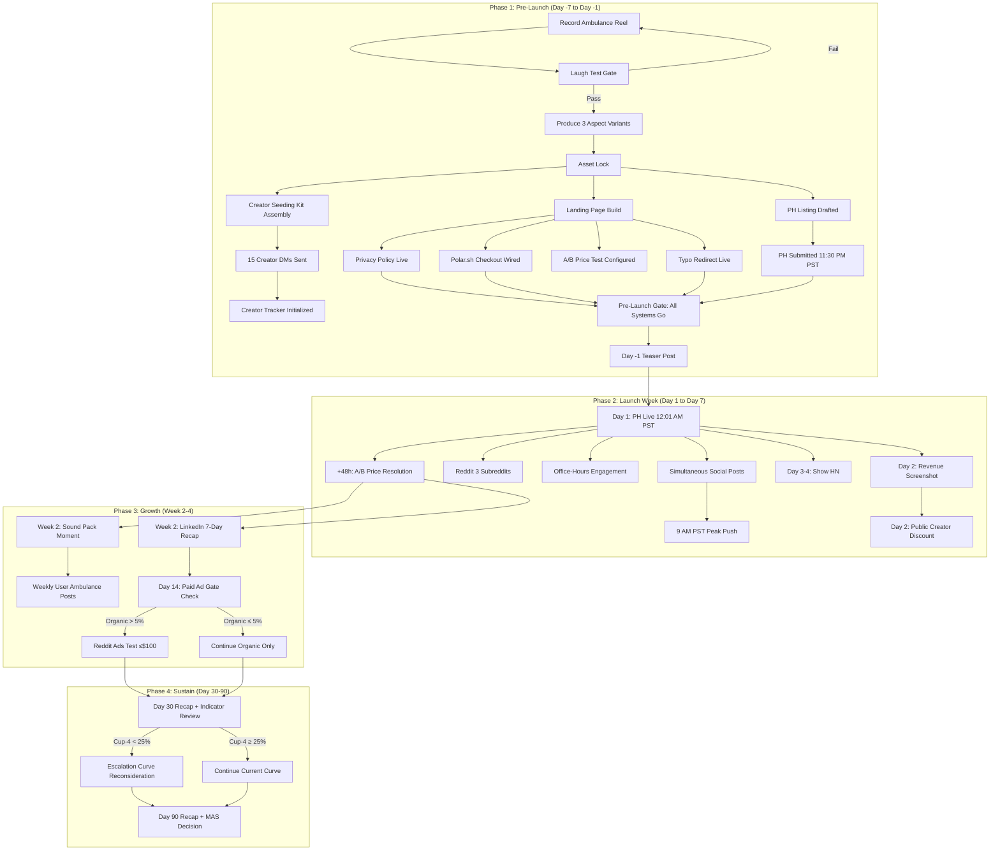
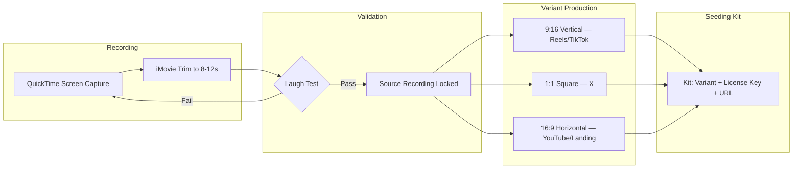
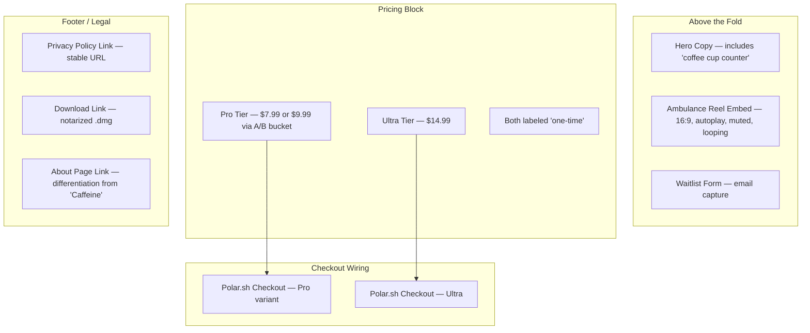
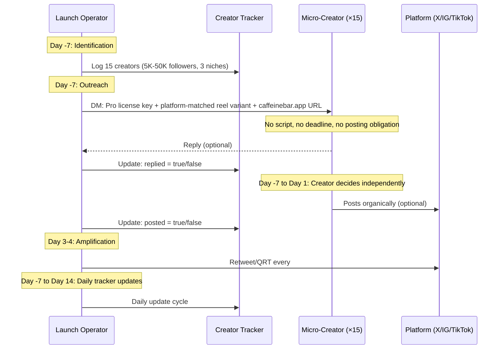
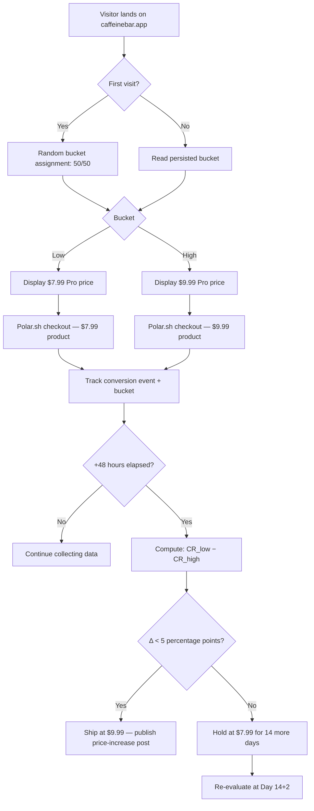
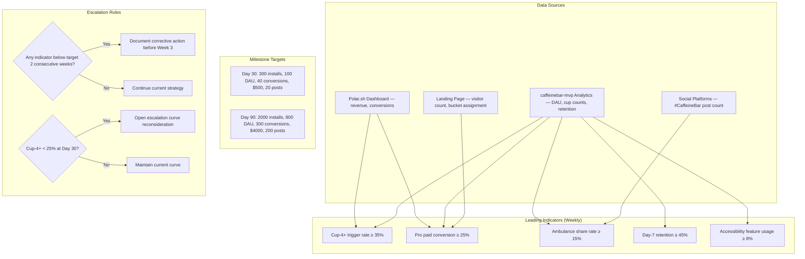
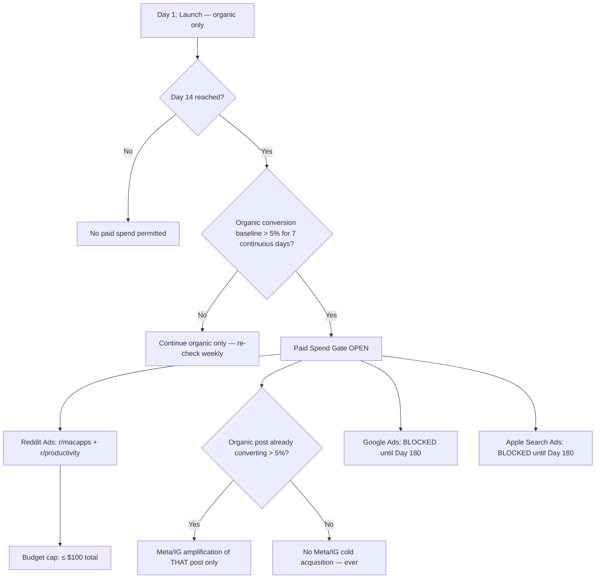
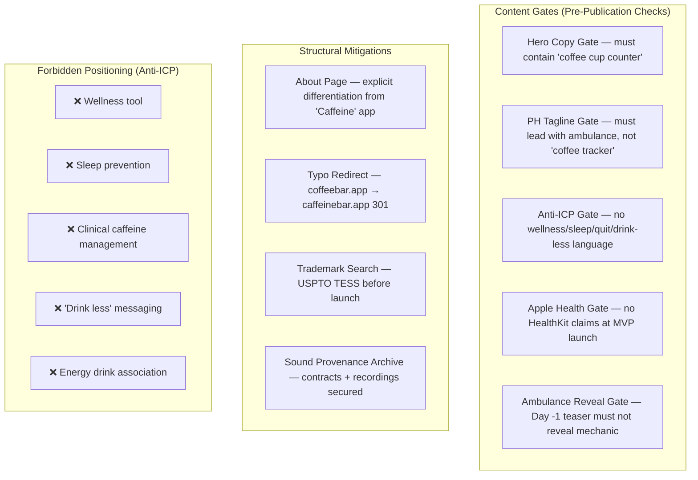

# Design Document — caffeinebar-launch

## Overview

This design specifies the operational architecture for CaffeineBar's launch program — the complete system of artefacts, channels, processes, and decision gates that take the app from a notarized `.dmg` to sustained organic growth over 90 days.

The launch program is executed by a single human operator (the founder). It is not a software system. The "components" are production pipelines, distribution channels, tracking frameworks, and escalation rules. The design is structured as an operational playbook architecture with clear phase boundaries, dependency graphs, and go/no-go gates.

**Key design decisions:**
- Single viral asset (Ambulance reel) as the atomic unit of all distribution — no per-platform creative divergence
- Creator seeding as the primary Day 1 amplification lever over paid acquisition
- A/B price test resolved by arithmetic rule, not subjective judgment
- Paid advertising gated behind proven organic conversion — never speculative
- Weekly leading-indicator cadence catches drift within 7 days, not 30

## Architecture

### Launch Timeline Architecture (Day -7 → Day 90)

The launch program operates across four distinct phases with hard gate boundaries between them.

### Phase Dependency Graph

## Components and Interfaces

This section defines the launch program's operational components — the artefacts, channels, processes, and control surfaces that the Launch operator builds and operates.

### Component 1: Asset Production Pipeline

The pipeline converts a single screen recording into a distribution-ready seeding kit.

**Inputs:**
- CaffeineBar app running on a real MacBook (non-virtualized)
- Cup count at 4 (ready to log Cup 5)
- Natural lighting, no studio setup

**Outputs:**
- One locked source recording (8–12 seconds)
- Three aspect-ratio variants (9:16, 1:1, 16:9)
- Seeding kit per creator (platform-matched variant + Pro license key + `caffeinebar.app` URL)

**Constraints (from Requirements 1–5):**
- No voiceover, no text overlay, no watermark, no post-production effects
- QuickTime + iMovie only — no third-party tools
- Asset lock ≥ 7 days before launch day
- Any post-lock content change resets the 7-day countdown

**Validation Gate:**
- First-playback laugh test (Requirement 3)
- Binary pass/fail — no partial passes
- Failure requires rework of the launch angle, not just re-recording

### Component 2: Landing Page Architecture (caffeinebar.app)

The landing page is the single conversion surface for all traffic sources. It hosts the viral hook, the pricing decision, and the purchase flow.

**Page Sections:**

| Section | Content | Requirements |
|---------|---------|--------------|
| Hero copy | First sentence contains "coffee cup counter"; no wellness/sleep language | Req 6 |
| Hero embed | 16:9 Ambulance reel, autoplay, muted, loops, click-to-unmute | Req 7 |
| Waitlist | Email field, confirmation on submit, live before and after launch | Req 9 |
| Pricing | Pro (A/B tested) + Ultra ($14.99), both "one-time", no subscription language | Req 8 |
| Checkout | Polar.sh links wired to active price variant per visitor bucket | Req 10 |
| Privacy | Stable URL, live ≥24h before launch | Req 11 |
| Download | Notarized `.dmg`, live ≥24h before launch | Req 11 |
| About | Differentiates from "Caffeine" sleep-prevention app | Req 52 |

**A/B Price Test Integration:**
- Visitor bucketing: 50/50 split on first page load
- Bucket persistence: cookie or local storage (same visitor always sees same price)
- Checkout link dynamically points to the bucketed Polar.sh product
- Resolution: at +48h, operator evaluates and collapses to single price

**Responsive Requirements:**
- Hero copy above fold at 1280px desktop and 375/390/414px mobile viewports
- Waitlist form above fold at all target viewports

### Component 3: Distribution Channel Strategy

Seven channels, each with a distinct framing and format. The Ambulance reel is the atomic content unit across all of them.

| Channel | Day | Format | Framing | Variant | Link Placement | Requirements |
|---------|-----|--------|---------|---------|----------------|--------------|
| Product Hunt | Day 1, 12:01 AM PST | Listing | Ambulance-led tagline, not "coffee tracker" | N/A (PH media) | Listing URL | Reqs 21, 22 |
| X (@git-scope) | Day 1 + 9 AM peak | Video post | Reel + PH link | 1:1 square | Post body | Req 23 |
| Instagram Reels | Day 1 + 9 AM peak | Reel | Reel, link in bio/comment | 9:16 vertical | Pinned comment | Req 23 |
| TikTok | Day 1 | Video | Reel, link in bio/comment | 9:16 vertical | Pinned comment | Req 23 |
| Reddit | Day 1 | Text + link | "I built this because I couldn't find it" | N/A | Post body | Req 24 |
| Hacker News | Day 3-4 | Show HN | Technical build story (Swift, MenuBarExtra) | N/A | Post body | Req 31 |
| LinkedIn | Week 2 | Text post | "I built a silly Mac app. Here's what happened." | N/A | Post body | Req 36 |

**Channel-Specific Rules:**

**Product Hunt:**
- Submitted 11:30 PM PST Day -1, live 12:01 AM PST Day 1
- Tagline leads with ambulance behaviour, never "coffee tracker"
- No wellness/sleep language
- 10+ warm-audience upvotes + comments in first 30 minutes

**X:**
- Day -1: single vague teaser (no ambulance reveal)
- Day 1: reel post + PH link
- Day 1 9 AM: follow-up push
- Day 2: revenue screenshot with specific numbers
- Day 3-4: retweet every `#CaffeineBar` creator post within 1 hour
- Week 2+: weekly user-ambulance-moment highlight

**Reddit (3 subreddits: r/macapps, r/SaaS, r/IndieHackers):**
- First-person "I built this" framing
- No price mentions for first 48 hours in comment threads
- Backup: r/programming dev log ready if primary posts removed
- Self-promotion engagement: non-sales participation for 48h

**Hacker News:**
- Show HN prefix required
- Technical framing: Swift, SwiftUI, MenuBarExtra API
- Links to caffeinebar.app, never directly to checkout
- No sales pitch language

**LinkedIn:**
- Week 2: 7-day revenue with specific figures
- Day 30: recap with retention + revenue
- Day 90: recap with cumulative figures

### Component 4: Creator Seeding Workflow

The seeding program is the primary organic amplification mechanism. It replaces paid acquisition for Day 1 reach.

**Creator Selection Criteria (Requirement 13):**
- Exactly 15 creators
- Follower count: 5,000–50,000 (micro-creator band)
- Three niches: developer-setup, macOS-productivity, indie-hacker build-in-public
- No mega-influencers (>500K) under any circumstance
- Completed by Day -7

**Seeding Kit Contents (Requirement 14):**
- One Pro tier license key (valid, no expiry condition tied to posting)
- Platform-matched aspect-ratio variant of the Ambulance reel
- Landing page URL: `caffeinebar.app`

**Anti-Patterns (Requirement 15):**
- No script or suggested caption
- No hashtag list
- No posting deadline
- No obligation to post
- License key validity never conditional on posting

**Tracking (Requirement 17):**
- Creator Tracker maintained per creator
- Fields: date contacted, replied (bool), posted (bool)
- Updated daily from Day -7 through Day 14

### Component 5: A/B Price Test Mechanics

The price test is a controlled experiment with a deterministic resolution rule. No subjective judgment enters the decision.

**Test Parameters:**
- Split: 50% low ($7.99) / 50% high ($9.99)
- Metric: conversion rate = purchases ÷ unique landing-page visitors per bucket
- Duration: minimum 48 hours from Day 1 launch moment
- Resolution rule (Requirement 48):
  - If `CR($7.99) − CR($9.99) < 5pp` → ship at $9.99
  - If `CR($7.99) − CR($9.99) ≥ 5pp` → hold at $7.99 for 14 days, then re-evaluate

**Resolution Actions:**
- On $9.99 win: update Landing page to single price, update Polar.sh checkout link, publish "raising the price" content moment on X (Requirement 33.4)
- On $7.99 hold: maintain both variants for 14 additional days, then re-run the same arithmetic

**Implementation Notes:**
- Bucket assignment persisted client-side (cookie/localStorage) to prevent same-visitor re-bucketing
- Conversion tracking via Polar.sh webhook or manual Polar.sh dashboard export
- No server-side infrastructure required — the operator computes the arithmetic manually at +48h

### Component 6: Metrics Tracking Framework

The tracking framework operates at two cadences: weekly leading indicators and milestone evaluations at Day 30 and Day 90.

**Leading Indicators (Requirement 45):**

| Indicator | Target | Source | Cadence |
|-----------|--------|--------|---------|
| Cup-4+ trigger rate | ≥ 35% of active users | App analytics | Weekly |
| Pro paid conversion (Cup-4 users) | ≥ 25% | Polar.sh + app analytics | Weekly |
| Ambulance share rate | ≥ 15% of Cup-5 events | Social monitoring | Weekly |
| Day-7 retention | ≥ 45% | App analytics | Weekly |
| Accessibility feature usage | ≥ 8% | App analytics | Weekly |

**Milestone Targets (Requirement 44):**

| Metric | Day 30 Target | Day 90 Target |
|--------|---------------|---------------|
| Installs | 300 | 2,000 |
| Daily Active Users | 100 | 800 |
| Pro paid conversions | 40 | 300 |
| Revenue | $500 | $4,000 |
| #CaffeineBar social posts | 20 | 200 |

**Review Cadence (Requirement 46):**
- Weekly: same weekday each week, compare each leading indicator to target
- Two consecutive misses on any indicator → documented corrective action required before third review
- Day 30: full milestone evaluation + escalation curve trigger check
- Day 90: full milestone evaluation + MAS distribution decision

### Component 7: Paid Advertising Gates and Escalation Rules

Paid spend is gated behind organic proof. The system is designed to prevent speculative ad spend against an unproven funnel.

**Gate Hierarchy:**

| Gate | Condition | Unlocks | Requirements |
|------|-----------|---------|--------------|
| Time gate | Day 14 elapsed | Eligibility for paid spend evaluation | Reqs 38, 39 |
| Organic baseline gate | 7-day rolling conversion > 5% | Actual paid spend initiation | Req 43 |
| Reddit test gate | Both above satisfied | Reddit ads in 2 named subreddits, ≤$100 | Req 41 |
| Meta/IG amplification gate | Specific organic post converting > 5% | Amplification of that post only | Req 40 |
| Google/ASA gate | Day 180 + branded search volume review | Google Ads and Apple Search Ads | Req 42 |

**Hard Rules:**
- Zero paid spend between Day -7 and Day 14 (no exceptions)
- No cold-audience Meta/Instagram campaigns (ever, at any budget)
- Reddit ads restricted to `r/macapps` and `r/productivity` only during initial test
- Google Ads and Apple Search Ads blocked until Day 180 minimum
- Every paid spend decision requires a written record of the 7-day organic baseline window (start date, end date, observed rate)

**Escalation Path:**
1. Organic baseline fails to reach 5% by Day 30 → continue organic, no paid spend
2. Organic baseline reaches 5% after Day 14 → unlock Reddit test ($50–$100)
3. Reddit test shows positive ROAS → operator may increase Reddit budget (no cap specified beyond initial test)
4. Specific organic post converts > 5% → amplify that post via Meta/IG
5. Day 180 → re-evaluate Google Ads and ASA based on branded search volume

### Component 8: Brand Risk Mitigation Controls

The brand risk system prevents name confusion with the existing "Caffeine" sleep-prevention app and avoids positioning in anti-ICP territories.

**Content Gate Matrix:**

| Gate | Applies To | Rule | Requirement |
|------|-----------|------|-------------|
| Literal phrase | Landing page hero | Must contain "coffee cup counter" in first sentence | Req 6 |
| Ambulance-led | PH tagline | Must lead with ambulance behaviour | Req 22 |
| Anti-ICP vocabulary | All launch artefacts | Banned words: wellness, sleep prevention, quit caffeine, cut down, drink less | Req 51 |
| Apple Health deferral | All launch artefacts | Banned words: Apple Health, HealthKit, logs to Health | Req 54 |
| Teaser secrecy | Day -1 post only | Banned words: ambulance, siren, skull, Cup 5, Cup five | Req 19 |
| Subscription language | Landing page pricing | Banned words: subscription, monthly, per month | Req 8 |

**Structural Mitigations:**

| Mitigation | Purpose | Deadline | Requirement |
|------------|---------|----------|-------------|
| About page | Differentiates from "Caffeine" sleep-prevention app | Live ≥24h before launch | Req 52 |
| coffeebar.app redirect | Captures typo traffic | Live ≥24h before launch | Req 12 |
| Trademark search | Prevents Day-2 brand contest | Before launch day | Req 56 |
| Sound provenance archive | Defensible copyright chain | Before any voice asset ships in marketing | Req 55 |

## Data Models

The launch program's data is tracked in lightweight local artefacts (spreadsheets, notes, dashboards). No database infrastructure is required.

### Creator Tracker Schema

| Field | Type | Description | Updated |
|-------|------|-------------|---------|
| creator_handle | string | Primary platform handle | Day -7 (set once) |
| platform | enum: X, Instagram, TikTok | Creator's primary platform | Day -7 (set once) |
| niche | enum: dev-setup, macos-productivity, indie-hacker | Creator's niche category | Day -7 (set once) |
| follower_count | integer (5000–50000) | Follower count at time of identification | Day -7 (set once) |
| date_contacted | date | Date the DM was sent | Day -7 (set once) |
| variant_sent | enum: 9:16, 1:1, 16:9 | Which aspect-ratio variant was attached | Day -7 (set once) |
| license_key_sent | string | The Pro license key included in the DM | Day -7 (set once) |
| replied | boolean | Whether the creator replied to the DM | Daily update |
| posted | boolean | Whether the creator posted #CaffeineBar content | Daily update |
| post_url | string (optional) | URL of the creator's organic post | On detection |
| retweeted | boolean | Whether the operator retweeted/QRT'd the post | On action |

### A/B Price Test Tracking Schema

| Field | Type | Description |
|-------|------|-------------|
| bucket | enum: low ($7.99), high ($9.99) | Visitor's assigned bucket |
| visitor_id | string | Anonymous visitor identifier (cookie-based) |
| first_visit_timestamp | datetime | When the visitor first landed |
| converted | boolean | Whether the visitor completed a Polar.sh purchase |
| conversion_timestamp | datetime (optional) | When the purchase completed |

**Derived Metrics:**
- `CR_low` = count(converted=true, bucket=low) ÷ count(bucket=low)
- `CR_high` = count(converted=true, bucket=high) ÷ count(bucket=high)
- `Δ` = CR_low − CR_high (in percentage points)

### Leading Indicator Weekly Log Schema

| Field | Type | Description |
|-------|------|-------------|
| week_number | integer | Week since launch (1, 2, 3, ...) |
| review_date | date | Date of the weekly review |
| cup4_trigger_rate | float (0–1) | Fraction of active users reaching Cup 4+ |
| pro_conversion_rate | float (0–1) | Fraction of Cup-4 users who purchased Pro |
| ambulance_share_rate | float (0–1) | Fraction of Cup-5 events shared publicly |
| day7_retention | float (0–1) | Cohort retention at Day 7 |
| accessibility_usage_rate | float (0–1) | Fraction using accessibility features |
| corrective_action_needed | boolean | True if any indicator below target 2 consecutive weeks |
| corrective_action_note | string (optional) | Documented corrective action |

### Paid Spend Decision Log Schema

| Field | Type | Description |
|-------|------|-------------|
| decision_date | date | Date the spend decision was made |
| baseline_window_start | date | Start of the 7-day organic baseline window |
| baseline_window_end | date | End of the 7-day organic baseline window |
| observed_conversion_rate | float | The organic conversion rate observed |
| platform | string | Which platform the spend targets |
| budget_approved | float | Dollar amount approved |
| rationale | string | Written justification |

## Error Handling

In an operational playbook, "errors" are blocked gates, failed validations, and external disruptions. This section defines the recovery paths.

### Asset Production Failures

| Failure | Detection | Recovery | Requirement |
|---------|-----------|----------|-------------|
| Laugh test fails | First playback — operator does not laugh | Rework launch angle, re-record from scratch | Req 3 |
| Asset lock violated | Operator identifies need for content change post-lock | Postpone launch day by 7 calendar days from new lock | Req 5 |
| Recording quality issue | Operator review during iMovie trim | Re-record (QuickTime only, no studio escalation) | Req 2 |

### Landing Page Failures

| Failure | Detection | Recovery | Requirement |
|---------|-----------|----------|-------------|
| Polar.sh checkout broken | Pre-launch manual test | Fix wiring before launch; do not launch with broken checkout | Req 10 |
| Privacy policy not live | Pre-launch check (≥24h before) | Deploy immediately; postpone launch if not fixable in time | Req 11 |
| A/B bucketing broken | Visitor reports seeing both prices | Fall back to single price ($7.99) until fixed | Req 8 |
| coffeebar.app redirect not working | Pre-launch DNS check | Escalate to registrar; non-blocking for launch | Req 12 |

### Distribution Channel Failures

| Failure | Detection | Recovery | Requirement |
|---------|-----------|----------|-------------|
| Reddit post removed (self-promotion) | Moderator notification | Deploy r/programming backup post within 24h | Req 34 |
| PH listing fails to go live at 12:01 AM | Manual check at 12:05 AM PST | Contact PH support; social posts proceed regardless | Req 22 |
| Creator DM delivery failure | Platform notification | Retry on alternate platform or replace creator from backup list | Req 14 |
| Show HN flagged/killed | HN moderation | No retry — accept the loss, focus on other channels | Req 31 |

### Metric and Decision Failures

| Failure | Detection | Recovery | Requirement |
|---------|-----------|----------|-------------|
| Insufficient data for A/B resolution at +48h | Sample size too small to compute meaningful CR | Extend test by 48h increments until minimum sample reached | Req 48 |
| Leading indicator below target 2 consecutive weeks | Weekly review | Document corrective action before third review | Req 46 |
| Cup-4+ trigger rate < 25% at Day 30 | Day 30 evaluation | Open written escalation curve reconsideration | Req 58 |
| Organic baseline never reaches 5% | Weekly check post-Day 14 | Continue organic-only indefinitely; no paid spend | Req 43 |

### Legal and Compliance Failures

| Failure | Detection | Recovery | Requirement |
|---------|-----------|----------|-------------|
| Trademark conflict found | USPTO TESS search result | Postpone launch until conflict resolved | Req 56 |
| Sound provenance incomplete | Pre-launch audit | Do not ship the asset in marketing until archive complete | Req 55 |
| Apple Health claim in launch copy | Content review | Remove immediately; no Apple Health language at MVP | Req 54 |

## Testing Strategy

### Why Property-Based Testing Does Not Apply

This spec defines a human-operated launch program — not a software system with pure functions, parsers, or algorithms. The "system under test" is a human operator following a checklist against external platforms (Product Hunt, X, Reddit, Instagram, TikTok, Polar.sh). There are no programmatic inputs to vary, no functions to call 100+ times, and no universal properties that hold across generated inputs.

Property-based testing is **not applicable** to this spec. The Correctness Properties section is omitted.

### Applicable Verification Approaches

The launch program is verified through **checklists, gate reviews, and arithmetic decision rules** — not automated test suites.

#### 1. Pre-Launch Checklist Verification

A manual go/no-go checklist run by the Launch operator before Day 1:

| Check | Pass Condition | Blocks Launch? |
|-------|---------------|----------------|
| Ambulance reel laugh test passed | Operator laughed on first playback | Yes |
| Asset lock ≥ 7 days before launch | Calendar math | Yes |
| 3 aspect-ratio variants produced | Files exist | Yes |
| 15 creator DMs sent | Creator tracker shows 15 entries with date_contacted | Yes |
| Landing page live at caffeinebar.app | HTTP 200 + visual check | Yes |
| Hero copy contains "coffee cup counter" | String search | Yes |
| Waitlist form accepting submissions | Test submission | Yes |
| Polar.sh checkout links working (both variants) | Test click-through | Yes |
| Privacy policy live | HTTP 200 at stable URL | Yes |
| Download link live (.dmg accessible) | HTTP 200 + download test | Yes |
| About page live | HTTP 200 | Yes |
| coffeebar.app redirecting to caffeinebar.app | curl -I check | No (nice-to-have) |
| PH listing submitted | PH dashboard confirmation | Yes |
| Trademark search completed and recorded | Dated record exists | Yes |
| Sound provenance archive complete | All contracts + recordings filed | Yes |
| r/programming backup post drafted | Draft exists | No (nice-to-have) |
| 10 warm-audience voters recruited | Confirmation messages | Yes |
| Day -1 teaser complies with Req 19 | Content review against banned words | Yes |

#### 2. Content Gate Verification

Every piece of launch copy passes through the content gate matrix before publication:

- **Automated string checks** (can be scripted): banned-word scan against the Anti-ICP vocabulary list, Apple Health deferral list, and teaser secrecy list
- **Manual review**: framing, tone, first-person voice for Reddit, technical framing for HN

#### 3. Arithmetic Decision Rule Verification

The A/B price test resolution is verified by:
- Computing `CR_low − CR_high` from Polar.sh data
- Applying the decision rule mechanically (< 5pp → ship $9.99; ≥ 5pp → hold $7.99)
- Recording the computation and result in the Paid Spend Decision Log

#### 4. Weekly Leading Indicator Review

Verification that the program is on track:
- Each indicator compared to its target
- Two consecutive misses trigger mandatory corrective action documentation
- Day 30 and Day 90 milestone evaluations against PRD §1.4 targets

#### 5. Post-Mortem Verification

At Day 30 and Day 90, the Launch operator publishes a public recap with specific figures. The recap itself serves as a verification artefact — if the numbers are below target, the corrective actions from the weekly reviews should already be documented.

