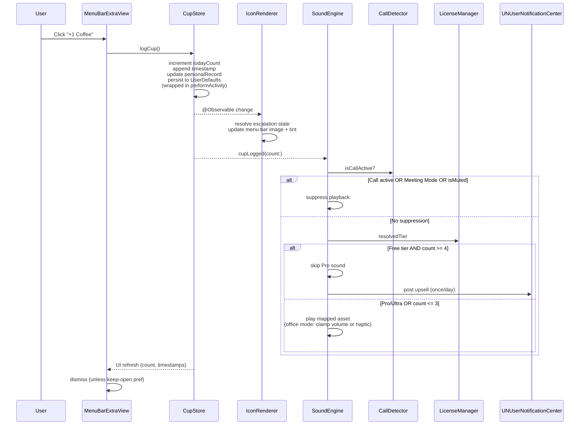
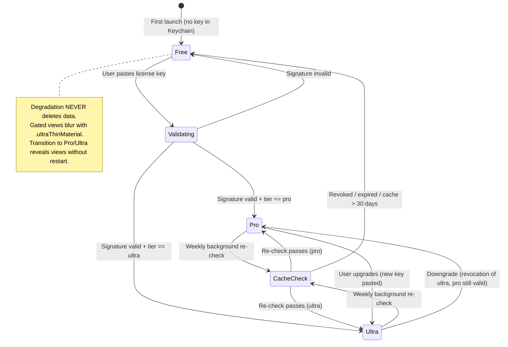

# Technical Design Document — CaffeineBar MVP

## Overview

CaffeineBar is a native macOS 13+ menu bar utility that tracks daily coffee intake via a single-click logging interface, renders escalating icon states in the system menu bar, and plays comedic sound effects that intensify with each cup. The MVP ships as a notarized `.dmg` with Free and Pro tiers, four bundled sound packs, call-aware audio suppression, full accessibility compliance, and Polar.sh-based licensing.

This design document specifies the architecture, data model, component interfaces, accessibility wiring, licensing state machine, build pipeline, and testing strategy required to implement the 60 requirements in `caffeinebar-mvp/requirements.md`.

---

## Architecture

### System Architecture (Module Dependency Graph)

```mermaid
graph TD
    App[CaffeineBarApp.swift<br/>Entry Point + MenuBarExtra]

    subgraph Views
        MBV[MenuBarExtraView]
        WGV[WeeklyGraphView]
        HLC[HalfLifeClock]
        SCV[ShareCardView]
        SV[SettingsView]
        IR[IconRenderer]
    end

    subgraph Engine
        CS[CupStore<br/>@Observable]
        SE[SoundEngine]
        CD[CallDetector]
        MM[MeetingMode]
        OM[OfficeMode]
    end

    subgraph Licensing
        LM[LicenseManager]
        PV[PriceVariant]
    end

    App --> MBV
    App --> IR
    MBV --> CS
    MBV --> HLC
    MBV --> WGV
    MBV --> SCV
    MBV --> SV
    MBV --> LM

    IR --> CS

    HLC --> CS
    WGV --> CS
    SCV --> CS
    SV --> CS
    SV --> LM
    SV --> SE

    SE --> CS
    SE --> CD
    SE --> MM
    SE --> OM
    SE --> LM

    CD --> CS
    LM --> PV

    CS -.->|UserDefaults| Persistence[(UserDefaults<br/>caffeinebar.*)]
    LM -.->|Keychain| Keychain[(macOS Keychain)]
```


### Data Flow: Log Action → State Update → Icon + Sound + Notification




### LicenseManager State Machine




### Daily Reset Timer Logic (Timezone-Safe)

```mermaid
flowchart TD
    A[Timer fires / App becomes active] --> B{Compute next reset boundary}
    B --> C[resetBoundary = Calendar.current.startOfDay(for: now)<br/>+ resetHour hours]
    C --> D{now >= resetBoundary<br/>AND lastResetDate < resetBoundary?}
    D -->|Yes| E[Fire daily reset]
    D -->|No| F[Schedule next check at resetBoundary]
    E --> G[Archive prior day count to history]
    G --> H{Prior day count > 0?}
    H -->|Yes| I[streakDays += 1<br/>totalDaysLogged += 1<br/>Play good night chime]
    H -->|No| J[streakDays = 0]
    I --> K[Reset todayCount = 0<br/>Clear todayTimestamps<br/>Set lastResetDate = resetBoundary]
    J --> K
    K --> F

    style E fill:#f9f,stroke:#333
    style K fill:#bbf,stroke:#333
```

**DST Safety:** The boundary is always computed from `Calendar.current.startOfDay(for:)` which accounts for DST transitions. The guard `lastResetDate < resetBoundary` ensures exactly one reset per logical day even if the clock jumps forward (spring) or backward (fall).

---

## File Structure

```
CaffeineBar/
├── CaffeineBarApp.swift              # App entry, MenuBarExtra registration
├── Info.plist                        # LSUIElement=true, deployment target 13.0
├── CaffeineBar.entitlements          # Hardened Runtime, network.client, audio
├── Assets.xcassets/                  # Color tokens, icon assets
│   ├── status.empty.colorset/
│   ├── status.active.colorset/
│   ├── status.warning.colorset/
│   ├── status.danger.colorset/
│   └── AppIcon.appiconset/
├── Sounds/                           # Bundled .m4a packs (≤ 2MB total)
│   ├── Default/
│   ├── YourMom/
│   ├── GordonRamsay/
│   ├── NASA/
│   └── Accountant/
├── Model/
│   └── CupStore.swift                # Engine Agent — Reqs 3–6, 32–37
├── Engine/
│   ├── SoundEngine.swift             # Audio Agent — Reqs 9–13, 21
│   ├── SoundPackRegistry.swift       # Audio Agent — Req 21
│   ├── CallDetector.swift            # Engine Agent — Req 14
│   ├── MeetingMode.swift             # Engine Agent — Req 16
│   └── OfficeMode.swift              # Engine Agent — Req 17
├── Licensing/
│   ├── LicenseManager.swift          # License Agent — Reqs 38–41, 43
│   └── PriceVariant.swift            # License Agent — Req 42
├── View/
│   ├── MenuBarExtraView.swift        # UI Agent — Reqs 2, 3, 4, 8, 22, 23
│   ├── IconRenderer.swift            # UI Agent — Reqs 1, 27
│   ├── WeeklyGraphView.swift         # UI Agent — Req 20
│   ├── HalfLifeClock.swift           # UI Agent — Reqs 18, 19
│   ├── ShareCardView.swift           # UI Agent — Req 7
│   └── SettingsView.swift            # UI Agent — Reqs 5, 6, 11, 15, 17–19, 21, 37–38, 42–43
└── CaffeineBarTests/
    ├── TimezoneResetTests.swift      # QA Agent — Req 54
    ├── HalfLifeMathTests.swift       # QA Agent — Req 55
    ├── LicenseSignatureTests.swift   # QA Agent — Req 56
    └── SoundEngineSoakTests.swift    # QA Agent — Req 57
```

| File | Owning Agent | Requirements Satisfied |
|------|-------------|----------------------|
| `CaffeineBarApp.swift` | Orchestrator | 46 |
| `CupStore.swift` | Core Engine | 3, 4, 5, 6, 15, 32, 33, 34, 35, 36, 37 |
| `SoundEngine.swift` | Audio & Media | 9, 10, 11, 12, 13, 17 |
| `SoundPackRegistry.swift` | Audio & Media | 21 |
| `CallDetector.swift` | Core Engine | 14 |
| `MeetingMode.swift` | Core Engine | 16 |
| `OfficeMode.swift` | Core Engine | 17 |
| `LicenseManager.swift` | Security & Licensing | 34, 38, 39, 40, 41, 43 |
| `PriceVariant.swift` | Security & Licensing | 42 |
| `MenuBarExtraView.swift` | SwiftUI Frontend | 2, 3, 4, 8, 22, 23, 24, 25, 28, 29 |
| `IconRenderer.swift` | SwiftUI Frontend | 1, 27 |
| `WeeklyGraphView.swift` | SwiftUI Frontend | 20 |
| `HalfLifeClock.swift` | SwiftUI Frontend | 18, 19 |
| `ShareCardView.swift` | SwiftUI Frontend | 7 |
| `SettingsView.swift` | SwiftUI Frontend | 5, 6, 11, 15, 17, 18, 19, 21, 37, 38, 42, 43 |
| `Assets.xcassets` | SwiftUI Frontend | 26 |
| `CaffeineBar.entitlements` | Build & Release | 48 |
| `Info.plist` | Build & Release | 44, 46 |
| `.github/workflows/release.yml` | Build & Release | 51 |


---

## Data Models

### CupStore Persisted Fields (Req 33)

| Field | Type | UserDefaults Key | Default | Notes |
|-------|------|-----------------|---------|-------|
| `todayCount` | `Int` | `caffeinebar.todayCount` | `0` | Resets on daily boundary |
| `todayTimestamps` | `[Date]` | `caffeinebar.todayTimestamps` | `[]` | ISO 8601 encoded array |
| `lastResetDate` | `Date` | `caffeinebar.lastResetDate` | `.distantPast` | Guards single-reset-per-day |
| `streakDays` | `Int` | `caffeinebar.streakDays` | `0` | Consecutive days with ≥1 log |
| `personalRecord` | `Int` | `caffeinebar.personalRecord` | `0` | Highest single-day count |
| `totalDaysLogged` | `Int` | `caffeinebar.totalDaysLogged` | `0` | Cumulative days with ≥1 log |
| `resetHour` | `Int` | `caffeinebar.resetHour` | `0` | 0–23, user-configurable |
| `bedtime` | `Date` | `caffeinebar.bedtime` | `22:00` | Time-of-day only |
| `metabolismProfile` | `String` | `caffeinebar.metabolismProfile` | `"normal"` | `fast` / `normal` / `slow` |
| `isMuted` | `Bool` | `caffeinebar.isMuted` | `false` | Global sound mute |
| `officeMode` | `Bool` | `caffeinebar.officeMode` | `false` | 50% volume or haptic |
| `autoMuteOnCalls` | `Bool` | `caffeinebar.autoMuteOnCalls` | `true` | Defaults ON (Req 15) |
| `installedSoundPacks` | `[String]` | `caffeinebar.installedSoundPacks` | All 4 bundled | Pack identifiers |
| `selectedSoundPack` | `String` | `caffeinebar.selectedSoundPack` | `"default"` | Active pack ID |
| `dataVersion` | `Int` | `caffeinebar.dataVersion` | `1` | Schema version (Req 32) |
| `dailyHistory` | `[DayRecord]` | `caffeinebar.dailyHistory` | `[]` | Archived day records |

### UserDefaults Schema Rules (Req 32)

- **Namespace:** Every key uses the `caffeinebar.` prefix.
- **Version field:** `caffeinebar.dataVersion = 1` from first build.
- **Migration trigger:** When `dailyHistory.count > 1000`, schedule background migration to SQLite/Core Data (Req 36). Migration runs on a background queue and never blocks the main thread.
- **Write protection:** Every mutation wrapped in `NSProcessInfo.shared.performActivity(.userInitiated)` (Req 35).

### Keychain Schema (Reqs 34, 39)

| Item | Keychain Class | Service | Account | Access Control |
|------|---------------|---------|---------|---------------|
| License Key | `kSecClassGenericPassword` | `app.caffeinebar.license` | `polar.sh` | `kSecAttrAccessibleWhenUnlockedThisDeviceOnly` + ACL scoped to CaffeineBar bundle ID |

- The license key payload (JSON with signature) is stored as `kSecValueData`.
- On macOS Migration Assistant or iCloud Keychain sync, the key follows the user's account.
- **Hard rule:** The license key NEVER appears in UserDefaults or any plaintext file (Req 34).

### DayRecord Model (for dailyHistory)

```swift
struct DayRecord: Codable {
    let date: Date          // Start-of-day (reset boundary)
    let count: Int          // Total cups that day
    let timestamps: [Date]  // Individual log times
}
```


---

## Components and Interfaces

### CupStore

**Owner:** Core Engine Agent  
**Requirements:** 3, 4, 5, 6, 15, 32, 33, 34, 35, 36, 37

```swift
@Observable
final class CupStore {
    // MARK: - Published State
    private(set) var todayCount: Int
    private(set) var todayTimestamps: [Date]
    private(set) var streakDays: Int
    private(set) var personalRecord: Int
    private(set) var totalDaysLogged: Int
    var resetHour: Int { didSet { persist() } }
    var bedtime: Date { didSet { persist() } }
    var metabolismProfile: MetabolismProfile { didSet { persist() } }
    var isMuted: Bool { didSet { persist() } }
    var officeMode: Bool { didSet { persist() } }
    var autoMuteOnCalls: Bool { didSet { persist() } }
    var selectedSoundPack: String { didSet { persist() } }
    private(set) var dailyHistory: [DayRecord]

    // MARK: - Public API
    func logCup()                    // Increment count, append timestamp, update record
    func undoLastCup()               // Decrement count, remove last timestamp
    func evaluateReset()             // Check if reset boundary crossed, fire if needed

    // MARK: - Internal
    private func persist()           // UserDefaults write wrapped in performActivity
    private func scheduleMigrationIfNeeded()  // Trigger when dailyHistory.count > 1000
}
```

**Key implementation notes:**
- `logCup()` wraps the entire mutation in `NSProcessInfo.shared.performActivity(.userInitiated)` to survive lid-close (Req 35).
- Undo buffer is bounded to 50 entries via a ring buffer on `todayTimestamps` (Req 4.5).
- `evaluateReset()` uses `Calendar.current.startOfDay(for: Date()) + TimeInterval(resetHour * 3600)` and guards with `lastResetDate < boundary` to ensure exactly one reset per logical day across DST transitions (Reqs 5.1–5.4).
- All keys prefixed `caffeinebar.` (Req 32). License key is NOT stored here (Req 34).

**Dependencies:** Foundation, `MetabolismProfile` enum, `DayRecord` struct.  
**Observers:** MenuBarExtraView, IconRenderer, SoundEngine, HalfLifeClock, WeeklyGraphView, ShareCardView.

---

### SoundEngine

**Owner:** Audio & Media Agent  
**Requirements:** 9, 10, 11, 12, 13, 17, 21

```swift
final class SoundEngine {
    // MARK: - Public API
    func cupLogged(count: Int, tier: LicenseTier)  // Resolve and play mapped sound
    func setMuted(_ muted: Bool)
    func setOfficeMode(_ mode: OfficeMode)
    func setSuppressed(_ suppressed: Bool)          // Called by CallDetector/MeetingMode

    // MARK: - Internal State
    private var currentPlayer: AVAudioPlayer?       // At most ONE (Req 12)
    private var isSuppressed: Bool                  // Call/Meeting mute active
    private var selectedPack: SoundPack

    // MARK: - Internal
    private func resolveAsset(for count: Int, tier: LicenseTier) -> URL?
    private func play(asset: URL)                   // Stop prior, nil, alloc new, [weak self]
}
```

**Key implementation notes:**
- **Single-instance recycling:** Before allocating a new `AVAudioPlayer`, call `currentPlayer?.stop()` then set `currentPlayer = nil` (Req 12.1–12.2).
- **Weak self:** Every `AVAudioPlayer` completion handler captures `[weak self]` (Req 12.3).
- **Lazy loading:** Assets loaded from bundle on first play, never at launch (Req 9.3).
- **Failure handling:** If `AVAudioPlayer(contentsOf:)` throws, log to `os_log` and return. CupStore still increments (Req 13).
- **Office Mode:** When active and not haptic-only, set `player.volume = min(requestedVolume, systemVolume * 0.5)`. When haptic-only, invoke `NSHapticFeedbackManager.defaultPerformer.perform(.generic, performanceTime: .now)` instead of playing audio (Req 17).
- **Cup-to-sound mapping:** Cups 1–3 always play (Free). Cups 4+ require `tier >= .pro`. Cup 6+ rotates through chaos pool (Req 10).

**Dependencies:** AVFoundation, `LicenseManager.resolvedTier`, `CupStore.isMuted`, `CallDetector`, `MeetingMode`, `OfficeMode`.

---

### CallDetector

**Owner:** Core Engine Agent  
**Requirements:** 14, 15

```swift
final class CallDetector {
    // MARK: - Public API
    var isCallActive: Bool { get }   // Computed from bundle scan + audio input

    // MARK: - Internal
    private let knownCallBundles: Set<String> = [
        "us.zoom.xos",
        "com.apple.FaceTime"
    ]
    private func scanRunningApplications() -> Bool
    private func checkCoreAudioInputStreams() -> Bool
}
```

**Key implementation notes:**
- `scanRunningApplications()` queries `NSWorkspace.shared.runningApplications` for bundle IDs in `knownCallBundles` that are frontmost or recently active (Req 14.1).
- `checkCoreAudioInputStreams()` uses CoreAudio's `AudioObjectGetPropertyData` on `kAudioHardwarePropertyDefaultInputDevice` to detect active capture streams — catches browser-based Meet/Teams (Req 14.2).
- Polled on a 2-second timer. Result cached to avoid excessive CoreAudio queries.
- `autoMuteOnCalls` defaults to `true` on first launch (Req 15).

**Dependencies:** AppKit (`NSWorkspace`), CoreAudio framework.

---

### LicenseManager

**Owner:** Security & Licensing Agent  
**Requirements:** 34, 38, 39, 40, 41, 42, 43

```swift
@Observable
final class LicenseManager {
    // MARK: - Public API
    private(set) var resolvedTier: LicenseTier = .free
    func validateAndStore(licenseKey: String) async -> ValidationResult
    func performBackgroundRecheck() async

    // MARK: - Types
    enum LicenseTier: Comparable { case free, pro, ultra }
    enum ValidationResult { case success(LicenseTier), invalidSignature, malformed }

    // MARK: - Internal
    private let publicKey: SecKey                    // Embedded in bundle (Req 40)
    private var cachedValidation: CachedValidation?  // lastCheck date + tier
    private func verifySignature(payload: Data, signature: Data) -> Bool
    private func readFromKeychain() -> String?
    private func writeToKeychain(_ key: String)
    private func deleteFromKeychain()
}
```

**Key implementation notes:**
- **Signature verification:** Uses `SecKeyVerifySignature` with the embedded public key against the Polar.sh-signed payload (Req 40). Pure client-side — no auth server.
- **Keychain ACL:** Stored with `kSecAttrAccessibleWhenUnlockedThisDeviceOnly` and an access group scoped to the CaffeineBar bundle (Req 39).
- **Offline cache:** Positive validation cached for 30 days. Weekly background re-check via `BGTaskScheduler` or a simple `Timer` (Req 41.1–41.2).
- **Graceful degradation:** On revocation/expiry, `resolvedTier` transitions to `.free`. No data is deleted, locked, or hidden (Req 41.4).
- **Tier propagation:** `resolvedTier` is `@Observable`. Views react immediately — no restart required (Req 23.3).
- **Ultra supersedes Pro:** `LicenseTier` conforms to `Comparable`; any `>= .pro` check passes for `.ultra`.

**Dependencies:** Security framework (Keychain, SecKey), Foundation.

---

### MenuBarExtraView

**Owner:** SwiftUI Frontend Agent  
**Requirements:** 2, 3, 4, 8, 22, 23, 24, 25, 28, 29

```swift
struct MenuBarExtraView: View {
    @Environment(CupStore.self) var store
    @Environment(LicenseManager.self) var license
    @Environment(\.accessibilityReduceMotion) var reduceMotion
    @Environment(\.dynamicTypeSize) var typeSize
    @FocusState private var focusedControl: PopoverControl?

    enum PopoverControl: Hashable {
        case logButton, undoButton, historyItem(Int), settingsGear
    }

    var body: some View { /* ... */ }
}
```

**Key implementation notes:**
- Fixed width 260pt, dynamic height (Req 24.3).
- Background: `.ultraThinMaterial` (Req 2.2).
- Hero count: `.system(size: 44, weight: .heavy, design: .rounded)` with `.dynamicTypeSize(...accessibility3)` (Req 24.1).
- At `.accessibility1+`, horizontal rows re-flow to vertical stacks (Req 24.2).
- Focus ring tab order: logButton → undoButton → historyItems → settingsGear (Req 28.5).
- Keyboard: ⌘+1/Space = log, ⌘+Z = undo, Esc = dismiss (Reqs 28.1–28.3).
- VoiceOver: `.accessibilityElement(children: .contain)` groups for hero, history, settings (Req 29.1).
- Reduce Motion: Cup 4 shake → bold-stroke fade-in; Cup 5+ pulse → static 5% red overlay; odometer → cross-fade (Req 25).
- Pro gate: HalfLifeClock and WeeklyGraphView blurred with `.overlay(.ultraThinMaterial)` + "Unlock Pro" CTA when `license.resolvedTier == .free` (Req 23.1).

---

### WeeklyGraphView

**Owner:** SwiftUI Frontend Agent  
**Requirements:** 20

```swift
struct WeeklyGraphView: View {
    let history: [DayRecord]        // Last 7 days from CupStore.dailyHistory
    let cutoffThreshold: Int?       // Computed from bedtime + metabolism

    var body: some View { /* Swift Charts BarMark */ }
}
```

**Key implementation notes:**
- Native `Swift Charts` `BarMark` for 7-day visualization (Req 20.1).
- Hover tooltip via `.chartOverlay` showing date + count (Req 20.2).
- Bars exceeding cut-off threshold rendered in `status.warning` color (Req 20.3).
- Only visible when `resolvedTier >= .pro`.

---

### HalfLifeClock

**Owner:** SwiftUI Frontend Agent  
**Requirements:** 18, 19

```swift
struct HalfLifeClock: View {
    let lastLogTimestamp: Date
    let metabolismProfile: MetabolismProfile
    let bedtime: Date

    // Computed
    var clearanceTime: Date { /* halfLife calculation */ }
    var isWithinCutoff: Bool { clearanceTime > bedtime }

    var body: some View { /* "Caffeine clears at 9:47 PM" */ }
}
```

**Key implementation notes:**
- Half-life values: Fast = 5h, Normal = 5.5h, Slow = 6h (Req 18.2).
- Clearance defined as ~6 half-lives (97% elimination): `lastLog + halfLife * 6`.
- Display as wall-clock time string, never raw hours (Req 18.4).
- VoiceOver label: "Caffeine clears your system at {time}" (Req 29.3).
- Cut-off warning: When `clearanceTime > bedtime`, post notification "That's your problem tonight." (Req 19.3).

---

### ShareCardView

**Owner:** SwiftUI Frontend Agent  
**Requirements:** 7

```swift
struct ShareCardView: View {
    let cupCount: Int
    let streakDays: Int
    let personalRecord: Int

    func renderToPasteboard() {
        let renderer = ImageRenderer(content: cardContent)
        renderer.scale = NSScreen.main?.backingScaleFactor ?? 2.0
        guard let image = renderer.nsImage else { return }
        NSPasteboard.general.clearContents()
        NSPasteboard.general.writeObjects([image])
    }
}
```

**Key implementation notes:**
- Offscreen render via `ImageRenderer` at native scale (Req 7.1).
- Includes: cup count, streakDays, personalRecord, `caffeinebar.app` watermark (Req 7.2).
- Writes to `NSPasteboard.general` (Req 7.3).
- Hidden behind Pro gate for Free users (Req 7.4).

---

### SettingsView

**Owner:** SwiftUI Frontend Agent  
**Requirements:** 5, 6, 11, 15, 17, 18, 19, 21, 37, 38, 42, 43

```swift
struct SettingsView: View {
    @Environment(CupStore.self) var store
    @Environment(LicenseManager.self) var license

    var body: some View {
        Form {
            // Reset hour picker (0–23)
            // Bedtime picker
            // Metabolism profile picker (Fast/Normal/Slow labels)
            // Mute toggle
            // Office Mode toggle + haptic sub-option
            // Auto-mute on calls toggle
            // Sound pack selector (Pro-gated)
            // License key entry field
            // Price display ($7.99 or $9.99 per priceVariant)
            // Streak stats (streakDays, personalRecord, totalDaysLogged)
            // "Streaks are per macOS user account" copy
            // Privacy policy link
        }
    }
}
```

---

### IconRenderer

**Owner:** SwiftUI Frontend Agent  
**Requirements:** 1, 27

```swift
struct IconRenderer {
    // MARK: - Public API
    static func icon(for count: Int) -> NSImage
    static func tint(for count: Int) -> Color
    static func accessibilityLabel(for count: Int, isInCutoff: Bool) -> String

    // MARK: - Escalation Mapping
    // 0: outline cup (system gray)
    // 1: filled cup (no tint override)
    // 2: filled + steam (no tint override)
    // 3: filled + lightning (no tint override)
    // 4: filled + exclamation (status.warning)
    // 5+: skull-and-crossbones (status.danger)
}
```

**Key implementation notes:**
- All icons are SF Symbols rendered as template images (Req 1.1, 1.8).
- Shape conveys state primarily; color is secondary (Req 27.1).
- VoiceOver labels update dynamically: "CaffeineBar. {N} cups logged. {state description}." (Req 29.2).


---

## Accessibility Architecture

**Requirements:** 24–31

### Dynamic Type Re-flow (Req 24)

| Dynamic Type Size | Layout Behavior |
|-------------------|----------------|
| `.xSmall` – `.xxxLarge` | Standard horizontal layout. Hero count at full 44pt weight. |
| `.accessibility1` | Horizontal rows re-flow to vertical stacks. Hero count remains 44pt. |
| `.accessibility2` | Same as above. Button text wraps if needed. |
| `.accessibility3` | Maximum supported. Popover height grows; width stays 260pt. |

**Implementation:** The popover uses `@Environment(\.dynamicTypeSize)` and a `ViewThatFits` or conditional `if typeSize >= .accessibility1` to switch between `HStack` and `VStack` layouts. The 260pt width constraint is applied via `.frame(width: 260)` on the container.

### Reduce Motion Fallbacks (Req 25)

| Animation | Standard | Reduce Motion Fallback |
|-----------|----------|----------------------|
| Cup 4 warning | Horizontal shake (2 cycles) | Bold-stroke fade-in |
| Cup 5+ emergency | Pulse scale 1.0→1.2 | Static 5% red material overlay |
| Count increment | Odometer roll | Cross-fade transition |
| Popover open | Native spring (OS-handled) | Native spring (unchanged) |

**Implementation:** Every animated view checks `@Environment(\.accessibilityReduceMotion)`. When `true`, `.animation(nil)` is applied and the fallback visual is rendered instead.

### VoiceOver Semantic Groups (Req 29)

```
Popover
├── Group 1: Hero Status (children: .combine)
│   ├── Hero count label: "{N} cups logged today"
│   ├── Escalation state: "Coffee level: {state}"
│   └── Hint: "Double tap to log another coffee"
├── Group 2: Log History (children: .contain)
│   ├── Landmark label: "Today's Log History"
│   └── Each timestamp: "Cup {N} at {time}"
├── Group 3: Pro Features (children: .contain)
│   ├── HalfLifeClock: "Caffeine clears your system at {time}"
│   └── WeeklyGraph: "Weekly caffeine chart. {summary}"
└── Group 4: Actions
    ├── +1 Coffee button
    ├── Undo button (hidden when count == 0)
    └── Settings gear
```

### Focus Rings and Keyboard Shortcuts (Req 28)

- Every interactive control uses `@FocusState` with a `PopoverControl` enum.
- Tab order enforced via `.focused($focusedControl, equals: .logButton)` etc.
- Keyboard bindings:
  - `⌘+1` or `Space` → log cup
  - `⌘+Z` → undo
  - `Esc` → dismiss popover
- Focus rings are native macOS blue rings (no custom styling).

### Color Independence (Req 27)

- Each escalation state has a **unique icon shape** (outline → filled → steam → lightning → exclamation → skull).
- Color tint is applied as a secondary signal only.
- In Increased Contrast mode (`@Environment(\.colorSchemeContrast) == .increased`), status chips get a 1pt solid border.

### Accessibility Nutrition Labels (Req 30)

Declared in distribution metadata:
- ✅ VoiceOver
- ✅ Full Keyboard Access
- ✅ Increase Contrast
- ✅ Reduce Motion
- ✅ Dynamic Type


---

## Licensing & Tier Gating Architecture

**Requirements:** 38–43

### Tier Hierarchy

```swift
enum LicenseTier: Int, Comparable, Codable {
    case free = 0
    case pro = 1
    case ultra = 2

    static func < (lhs: Self, rhs: Self) -> Bool { lhs.rawValue < rhs.rawValue }
}
```

Ultra strictly supersedes Pro: any `tier >= .pro` check passes for `.ultra`. This ensures a single gating mechanism across the codebase.

### Signature Verification Flow (Req 40)

1. User pastes license key string into SettingsView.
2. `LicenseManager.validateAndStore(licenseKey:)` is called.
3. Parse the key as a JSON payload: `{ "tier": "pro", "email": "...", "issued": "...", "signature": "..." }`.
4. Extract the `signature` field (Base64-encoded).
5. Compute the canonical payload (all fields except `signature`, sorted keys, UTF-8).
6. Call `SecKeyVerifySignature(publicKey, .ecdsaSignatureMessageX962SHA256, payloadData, signatureData, &error)`.
7. If verification succeeds → store in Keychain, set `resolvedTier`, cache validation timestamp.
8. If verification fails → return `.invalidSignature`, tier remains `.free`.

### Offline Cache Decay (Req 41)

| Condition | Behavior |
|-----------|----------|
| Last successful check ≤ 7 days ago | No action. Tier remains as cached. |
| Last successful check 7–30 days ago | Attempt background re-check. On failure, continue with cached tier. |
| Last successful check > 30 days ago | Cache expired. Degrade to `.free`. |
| Re-check returns revoked/expired | Immediate degrade to `.free`. |

**Degradation guarantee:** Transitioning to `.free` NEVER deletes, locks, or hides any logged data (Req 41.4). Pro features blur behind `.ultraThinMaterial` with an "Unlock Pro" CTA.

### Tier Change Propagation (No Restart)

- `LicenseManager.resolvedTier` is `@Observable`.
- All gated views use `if license.resolvedTier >= .pro` conditionals.
- On tier change, SwiftUI's observation system triggers immediate re-render.
- No `NotificationCenter` post or manual refresh needed.

### A/B Price Test (Req 42)

- `PriceVariant` is a compile-time build flag (`PRICE_VARIANT = "7.99"` or `"9.99"`).
- Surfaces in SettingsView as "$7.99 — Pro" or "$9.99 — Pro".
- Local conversion counter persisted in UserDefaults (`caffeinebar.conversionCount.{variant}`).
- Resolution: at +48 hours post-launch, compare conversion rates and lock the winner.


---

## Build & Distribution Pipeline

**Requirements:** 44–53

### Xcode Project Configuration

| Setting | Value | Requirement |
|---------|-------|-------------|
| `MACOSX_DEPLOYMENT_TARGET` | `13.0` | 44 |
| `LSUIElement` | `true` | 46 |
| Hardened Runtime | Enabled | 48 |
| Swift version | 5.9+ | 45 |
| Bundle size target | < 5 MB | 47 |

### Entitlements (`CaffeineBar.entitlements`)

```xml
<?xml version="1.0" encoding="UTF-8"?>
<!DOCTYPE plist PUBLIC "-//Apple//DTD PLIST 1.0//EN" "...">
<plist version="1.0">
<dict>
    <key>com.apple.security.app-sandbox</key>
    <false/>
    <key>com.apple.security.network.client</key>
    <true/>
    <key>com.apple.security.device.audio-input</key>
    <true/>
</dict>
</plist>
```

- `network.client`: Required for Polar.sh license validation and Sparkle update checks (Req 48.2).
- `audio-input`: Required for CoreAudio input-stream detection in CallDetector (Req 48.3).
- App Sandbox is **disabled** at MVP (direct-download `.dmg`). Enables `NSWorkspace` access for CallDetector.

### GitHub Actions Workflow (Req 51)

```yaml
# .github/workflows/release.yml
name: Build, Sign & Notarize
on:
  push:
    tags: ['v*']

jobs:
  release:
    runs-on: macos-14
    steps:
      - uses: actions/checkout@v4
      - name: Build
        run: xcodebuild -scheme CaffeineBar -configuration Release archive
      - name: Sign
        run: codesign --deep --force --options runtime --sign "$SIGNING_IDENTITY" ...
      - name: Notarize
        run: |
          xcrun notarytool submit CaffeineBar.dmg \
            --apple-id "$APPLE_ID" \
            --team-id "$TEAM_ID" \
            --password "$APP_PASSWORD" \
            --wait
      - name: Fail on non-success
        run: |
          STATUS=$(xcrun notarytool info ... --output-format json | jq -r '.status')
          if [ "$STATUS" != "Accepted" ]; then exit 1; fi
      - name: Staple
        run: xcrun stapler staple CaffeineBar.dmg
      - name: Upload artifact
        uses: actions/upload-artifact@v4
        with:
          name: CaffeineBar.dmg
          path: CaffeineBar.dmg
```

### Sparkle Integration (Req 50)

- Sparkle framework linked as a Swift Package dependency.
- `SUFeedURL` in Info.plist points to `https://caffeinebar.app/appcast.xml`.
- Update checks on launch + every 24 hours.
- User-facing prompt for install with release notes.

### Notarization Rehearsal (Req 52)

- Execute on a **clean macOS VM** (no developer certificates) ≥ 3 days before launch.
- Verify the `.dmg` opens without Gatekeeper warnings.
- Any entitlement change after rehearsal voids it — re-run required.

### Final Ship Gate (Req 60)

```bash
xcrun notarytool submit CaffeineBar.dmg \
  --keychain-profile "Developer-Notarization" \
  --wait
# Must return: status: Accepted
# Only then publish download link on caffeinebar.app
```


---

## Correctness Properties

*A property is a characteristic or behavior that should hold true across all valid executions of a system — essentially, a formal statement about what the system should do. Properties serve as the bridge between human-readable specifications and machine-verifiable correctness guarantees.*

### Property 1: Escalation state mapping is total and deterministic

*For any* non-negative integer cup count, the `IconRenderer.icon(for:)` function SHALL return exactly one of the six defined escalation glyphs, and `IconRenderer.tint(for:)` SHALL return the corresponding semantic color, such that the mapping is: 0→outline/gray, 1→filled/none, 2→steam/none, 3→lightning/none, 4→exclamation/warning, 5+→skull/danger.

**Validates: Requirements 1.2, 1.3, 1.4, 1.5, 1.6, 1.7**

### Property 2: Log action increments count and appends timestamp

*For any* valid CupStore state with `todayCount == N`, after calling `logCup()`, the resulting state SHALL have `todayCount == N + 1` and `todayTimestamps.count` SHALL equal the prior count plus one, with the new timestamp being the most recent entry.

**Validates: Requirements 3.1**

### Property 3: Undo is the left-inverse of log

*For any* CupStore state with `todayCount > 0`, calling `undoLastCup()` SHALL produce `todayCount == N - 1` and SHALL remove the most recent timestamp from `todayTimestamps`, restoring the state to what it was before the last `logCup()`.

**Validates: Requirements 4.3**

### Property 4: Undo visibility invariant

*For any* non-negative cup count, the undo affordance SHALL be visible if and only if `todayCount > 0`.

**Validates: Requirements 4.1, 4.2**

### Property 5: Undo buffer is bounded

*For any* sequence of N log actions where N > 50, the undo history depth SHALL never exceed 50 entries.

**Validates: Requirements 4.5**

### Property 6: Daily reset fires exactly once per logical day

*For any* timezone (including those with DST transitions) and any user-configured reset hour (0–23), the daily reset SHALL fire exactly once per logical day. It SHALL never skip a day and SHALL never fire twice for the same logical day, even when the clock springs forward or falls back.

**Validates: Requirements 5.1, 5.2, 5.3, 5.4**

### Property 7: Streak logic on daily reset

*For any* daily reset event, if the prior day's cup count was greater than 0, then `streakDays` SHALL increment by 1 and `totalDaysLogged` SHALL increment by 1. If the prior day's cup count was 0, then `streakDays` SHALL reset to 0.

**Validates: Requirements 6.2, 6.3**

### Property 8: Personal record is monotonically non-decreasing

*For any* log action, `personalRecord` SHALL equal `max(previousPersonalRecord, newTodayCount)`. The personal record SHALL never decrease.

**Validates: Requirements 6.4**

### Property 9: Cup-to-sound mapping respects tier gating

*For any* (cupCount, licenseTier) pair, the SoundEngine SHALL: play the mapped Free-tier asset when cupCount ∈ {1,2,3} regardless of tier; play the mapped Pro-tier asset when cupCount ∈ {4,5,6+} AND tier ≥ .pro; and suppress the Pro sound (playing nothing or a teaser) when cupCount ≥ 4 AND tier == .free.

**Validates: Requirements 10.1, 10.2, 10.3, 10.4, 10.5, 10.6**

### Property 10: Audio suppression under mute conditions

*For any* combination of (isMuted, meetingModeActive, callDetectorActive), the SoundEngine SHALL suppress audio playback if ANY of these conditions is true, while the MenuBarIcon SHALL always update to the correct escalation state regardless of mute conditions.

**Validates: Requirements 11.2, 11.3, 14.3, 16.2**

### Property 11: Single AVAudioPlayer invariant

*For any* sequence of sound play requests, at most one `AVAudioPlayer` instance SHALL exist at any point in time. After each play request completes or a new request begins, the prior player SHALL have been stopped and deallocated.

**Validates: Requirements 12.1, 12.2, 12.3**

### Property 12: Call detection logic

*For any* set of running application bundle IDs and CoreAudio input stream states, `CallDetector.isCallActive` SHALL be true if and only if (a known call bundle ID is among running applications AND is frontmost/recently active) OR (the default input device has an active capture stream).

**Validates: Requirements 14.1, 14.2**

### Property 13: Half-life clearance time computation

*For any* (lastLogTimestamp, metabolismProfile) pair where metabolismProfile maps to halfLife ∈ {5.0, 5.5, 6.0} hours, the computed clearance time SHALL equal `lastLogTimestamp + (halfLife × clearanceFactor)` where clearanceFactor represents the number of half-lives for 97% elimination (~6).

**Validates: Requirements 18.1, 18.2**

### Property 14: Cut-off warning fires correctly

*For any* (currentTime, bedtime, clearanceTime, licenseTier) tuple, the cut-off warning SHALL be active if and only if `clearanceTime > bedtime` AND `licenseTier >= .pro`.

**Validates: Requirements 19.2, 19.3**

### Property 15: Office mode volume constraint

*For any* (officeMode, hapticOnly) configuration, when officeMode is true AND hapticOnly is false, the effective playback volume SHALL not exceed 50% of the system output volume. When officeMode is true AND hapticOnly is true, no audio SHALL play and a haptic feedback event SHALL fire instead.

**Validates: Requirements 17.2, 17.3**

### Property 16: Tier gating never deletes data

*For any* tier transition (Pro→Free, Ultra→Free, Ultra→Pro), the total count of logged cup entries, timestamps, streak values, and history records SHALL remain unchanged before and after the transition.

**Validates: Requirements 23.2, 41.4**

### Property 17: Persistence round-trip

*For any* valid CupStore state, serializing all persisted fields to UserDefaults and then deserializing them back SHALL produce a state equivalent to the original for every declared field in Requirement 33.

**Validates: Requirements 32.1, 33.1**

### Property 18: UserDefaults key prefix invariant

*For any* key written by CupStore to UserDefaults, the key SHALL begin with the prefix `caffeinebar.`.

**Validates: Requirements 32.1, 32.2**

### Property 19: License key exclusion from UserDefaults

*For any* license key stored via LicenseManager, querying all UserDefaults keys SHALL never return a key whose value contains the license key string.

**Validates: Requirements 34.1, 34.2, 34.3**

### Property 20: Signature verification correctness

*For any* (payload, signature) pair, `LicenseManager.verifySignature` SHALL return true if and only if the signature is a valid ECDSA signature of the payload under the embedded public key. Invalid, malformed, or wrong-key signatures SHALL always return false.

**Validates: Requirements 40.1, 40.2, 40.3**

### Property 21: Offline cache validity

*For any* (lastCheckDate, currentDate) pair, the offline cache SHALL be considered valid if and only if `(currentDate - lastCheckDate) ≤ 30 days`. When the cache expires, `resolvedTier` SHALL transition to `.free`.

**Validates: Requirements 41.1, 41.2, 41.3**

### Property 22: Price variant display consistency

*For any* `priceVariant` value in {"7.99", "9.99"}, the SettingsView SHALL display the price string matching that variant, and the checkout link SHALL point to the corresponding Polar.sh checkout URL.

**Validates: Requirements 42.1, 42.2, 42.3**

### Property 23: Migration trigger threshold

*For any* CupStore state where `dailyHistory.count > 1000`, the migration to SQLite/Core Data SHALL be scheduled. The migration SHALL execute on a background queue and SHALL never block the main thread or any popover render path.

**Validates: Requirements 36.1, 36.2**

### Property 24: Upsell notification fires correctly

*For any* (licenseTier, cupCount, alreadyShownToday) state, the Cup 4 upsell notification SHALL fire if and only if `licenseTier == .free` AND `cupCount == 4` AND `alreadyShownToday == false`.

**Validates: Requirements 22.1, 22.2**

### Property 25: Sound pack selection routes correctly

*For any* `selectedSoundPack` value, all subsequent sound play requests SHALL resolve assets from the selected pack's directory, not from any other pack.

**Validates: Requirements 21.2, 21.3**


---

## Error Handling

### Sound Asset Failures (Req 13)

| Failure | Behavior |
|---------|----------|
| `.m4a` file missing from bundle | Log error via `os_log(.error)`. CupStore still increments. Icon still updates. |
| `AVAudioPlayer(contentsOf:)` throws | Same as above. No user-visible error. |
| Playback interrupted by system | Player delegate logs interruption. No retry. |

### License Validation Failures (Reqs 40, 41)

| Failure | Behavior |
|---------|----------|
| Malformed JSON payload | Return `.malformed`. Tier stays `.free`. |
| Invalid signature | Return `.invalidSignature`. Tier stays `.free`. |
| Network unreachable during re-check | Continue with cached tier until 30-day expiry. |
| Cache expired (> 30 days offline) | Degrade to `.free`. Data preserved. |

### Persistence Failures (Req 35)

| Failure | Behavior |
|---------|----------|
| UserDefaults write interrupted by suspension | `performActivity` prevents suspension during write. |
| Keychain write fails (disk full, locked) | Log error. Tier remains `.free`. User prompted to retry. |
| Migration to SQLite fails | Log error. Continue using UserDefaults. Retry on next launch. |

### CallDetector Failures (Req 14)

| Failure | Behavior |
|---------|----------|
| CoreAudio query fails | Fall back to bundle-ID-only detection. Log warning. |
| `NSWorkspace` unavailable | Assume no call active. Log warning. |

### General Principle

The app follows a **"never crash, never block, never lose data"** philosophy:
- Audio failures are silent to the user.
- License failures degrade gracefully.
- Persistence failures are retried.
- Detection failures fall back to safe defaults (no mute = user hears sound, which is less catastrophic than muting when no call exists).


---

## Testing Strategy

### Dual Testing Approach

CaffeineBar uses both **unit tests** (specific examples, edge cases) and **property-based tests** (universal properties across generated inputs). The property-based testing library is **swift-testing** with the `swift-custom-dump` package for diffing, combined with a lightweight PBT harness using `SwiftCheck` or a custom generator approach.

### Property-Based Test Configuration

- **Library:** SwiftCheck (or equivalent Swift PBT library)
- **Minimum iterations:** 100 per property test
- **Tag format:** `Feature: caffeinebar-mvp, Property {N}: {title}`
- Each property test references its design document property number

### Unit Test Targets Mapped to Requirements

| Test File | Requirements | What It Tests |
|-----------|-------------|---------------|
| `TimezoneResetTests.swift` | 54 | DST transitions in PST, IST, GMT. Asserts exactly one reset per logical day. |
| `HalfLifeMathTests.swift` | 55 | Fast/Normal/Slow profiles. Zero-cup edge case. Pre-midnight edge case. |
| `LicenseSignatureTests.swift` | 56 | Valid key, malformed payload, wrong key, expired cache (> 30 days). |
| `SoundEngineSoakTests.swift` | 57 | 1000+ sequential logs under Instruments Leaks. No retained players. |
| `CupStoreTests.swift` | 3, 4, 5, 6, 32, 33 | Log, undo, reset, streak, persistence round-trip, key prefix. |
| `IconRendererTests.swift` | 1 | All 6 escalation states produce correct glyph + tint. |
| `SoundMappingTests.swift` | 10, 11, 12 | Cup-to-sound mapping, mute behavior, single-player invariant. |
| `CallDetectorTests.swift` | 14, 15 | Bundle ID detection, CoreAudio heuristic, default-on behavior. |
| `LicenseManagerTests.swift` | 38, 39, 40, 41 | Keychain storage, signature verification, cache decay, tier transitions. |
| `OfficeModeMeetingModeTests.swift` | 16, 17 | Volume clamping, haptic routing, meeting mode suppression. |

### Property-Based Tests (mapped to Correctness Properties)

| Property # | Test Description | Generator Strategy |
|-----------|-----------------|-------------------|
| 1 | Escalation mapping | Generate random `UInt` (0–1000). Verify mapping is total. |
| 2 | Log increments | Generate random starting state (count 0–100). Log. Assert count+1. |
| 3 | Undo inverse | Generate state with count 1–100. Undo. Assert count-1 and last timestamp removed. |
| 6 | Reset once per day | Generate random timezone + reset hour + DST transition date. Simulate. Assert exactly 1 reset. |
| 7 | Streak logic | Generate random (priorCount: 0–10). Reset. Assert streak behavior. |
| 8 | Personal record | Generate random (currentRecord, newCount). Assert max. |
| 9 | Sound tier gating | Generate random (count: 1–10, tier: free/pro/ultra). Assert correct asset or suppression. |
| 10 | Audio suppression | Generate random (isMuted, meetingMode, callActive). Assert suppression iff any true. |
| 13 | Half-life math | Generate random (timestamp, profile). Assert clearance formula. |
| 17 | Persistence round-trip | Generate random CupStore state. Persist. Read. Assert equality. |
| 20 | Signature verification | Generate random payloads. Sign with correct key → pass. Sign with wrong key → fail. |
| 21 | Cache validity | Generate random (lastCheck, now) date pairs. Assert validity iff ≤ 30 days. |

### Instruments Soak Test (Req 57)

- Run 1000+ sequential `logCup()` calls with sound playback enabled.
- Execute under Instruments Leaks template.
- **Pass criteria:** Zero `AVAudioPlayer` instances retained beyond their playback cycle.
- **Fail criteria:** Any leaked player instance fails the release.

### Manual QA Gates

| Gate | Requirement | Procedure |
|------|-------------|-----------|
| Accessibility Inspector Audit | 58 | All 6 escalation states × Light/Dark/Increased Contrast. Verify contrast ≥ 4.5:1 and VoiceOver labels present. |
| Call-Mute Verification | 59 | Start FaceTime, Zoom, browser Meet in turn. Log cup during each. Confirm audio suppressed, icon updates. |
| Notarization Rehearsal | 52 | Clean macOS VM, no dev certs, ≥ 3 days before launch. |
| Final Ship Gate | 60 | `xcrun notarytool submit ... --wait` returns `Accepted`. |

### Test Execution Order

1. **CI (every push):** Unit tests + property-based tests (automated).
2. **Pre-release:** Instruments soak test (automated + manual review).
3. **Pre-release:** Accessibility Inspector audit (manual).
4. **Pre-release:** Call-mute verification (manual).
5. **Release day:** Notarization submission + final ship gate.
