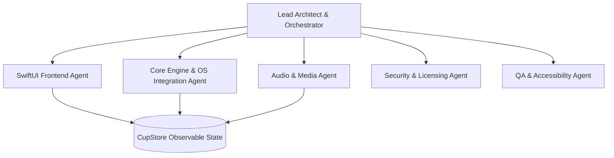

# CaffeineBar: AI Agent Architecture (`AGENTS.md`)
**Version:** 1.0  
**Project:** CaffeineBar macOS App  
**Role Definition:** Multi-Agent Collaboration & Delegation Protocol

This document outlines the specialized AI agent roles, responsibilities, prompt scopes, and tool integrations designed to execute the build plan for CaffeineBar. Each agent represents a distinct cognitive context tailored to specific components of the codebase.

---



---

## 1. Agent Directory & Roles

### 1.1 Lead Architect Agent (Orchestrator)
* **Scope:** Coordinates overall file generation, performs structural review, manages the task checklist (`task.md`), and routes complex tasks to specialized subagents.
* **Core Competencies:** Codebase architecture, dependency graphing, API contract design, and branch merge resolution.
* **Key Tasks:** Scaffolding the Xcode project, configuring `Info.plist` target properties (`LSUIElement = true`), and orchestrating app lifecycle states.

### 1.2 SwiftUI Frontend Agent (UI/UX Designer)
* **Scope:** Responsible for building all SwiftUI components, layout sheets, menus, and charts.
* **Core Competencies:** HIG guidelines, `.ultraThinMaterial` integration, Responsive container layout, Swift Charts, and typography hierarchy.
* **Key Tasks:** 
  - `MenuBarExtraView.swift`: Popover structure, hero text scaling, hover/press states.
  - `WeeklyGraphView.swift`: Swift Charts integration with custom hover tooltips.
  - `SettingsView.swift`: Form layout for settings, license entry, and premium lockout blur screens.
  - `ShareCardView.swift`: ImageRenderer configurations for high-DPI clipboard sharing.

### 1.3 Core Engine & OS Integration Agent
* **Scope:** Owns state machine processing, file system persistence, OS-level hooks, and background tasks.
* **Core Competencies:** UserDefaults persistence, timezone safety/DST logic, OS lifecycle events, and process inspection.
* **Key Tasks:**
  - `CupStore.swift`: Core state, timezone-safe daily reset timer, and `NSProcessInfo.shared.performActivity` write protections.
  - `CallDetector.swift`: Process scanner (`NSWorkspace.shared.runningApplications`) and CoreAudio active microphone input stream listeners.

### 1.4 Audio & Media Agent
* **Scope:** Manages all audio playback lifecycles, sound pack bundling, and system haptic engines.
* **Core Competencies:** `AVAudioPlayer` resource management, low-latency playback, multi-threading, and haptic feedback.
* **Key Tasks:**
  - `SoundEngine.swift`: Memory-safe AVAudioPlayer wrapper, resource disposal, volume limits, and `NSHapticFeedbackManager` integrations.

### 1.5 Security & Licensing Agent
* **Scope:** Manages purchase validation, cryptographic key verification, and secure storage.
* **Core Competencies:** Cryptography (public-key signature verification), macOS Keychain Services, and local offline caching rules.
* **Key Tasks:**
  - `LicenseManager.swift`: Polar.sh license decryption, secure Keychain read/write, and offline validation decay limits.

### 1.6 QA & Accessibility Agent
* **Scope:** Executes unit, UI, performance, accessibility, and notarization test sweeps.
* **Core Competencies:** XCTest, Accessibility Inspector, VoiceOver Rotor setup, and Apple Notarization CLI tools.
* **Key Tasks:**
  - `CaffeineBarTests/`: Test suites for clearance calculations, timezone resets, and license validity.
  - Accessibility Audit: Adding dynamic type constraints, accessibility labels/hints, and Reduce Motion toggle listeners.

---

## 2. Agent Prompt Persona Templates

### SwiftUI Frontend Agent Prompt
```
You are the SwiftUI Frontend Agent. Your task is to build pixel-perfect, HIG-compliant macOS views.
Strict Rules:
1. No hardcoded colors. Use native materials or Asset Catalog tokens with Light/Dark/Contrast variants.
2. Every text label must support Dynamic Type. Scale layouts into vertical stacks if font sizes exceed .accessibility1.
3. Every interactive control must have custom focus rings and a sequential tab order.
4. Listen to @Environment(\.accessibilityReduceMotion) and deactivate scaling/horizontal-shake/pulse animations if active.
```

### Core Engine Agent Prompt
```
You are the Core Engine Agent. Your task is to handle the state machine and OS-level integrations.
Strict Rules:
1. Midnight resets must be timezone-safe. Use Calendar.current.startOfDay(for:) and verify against DST changes.
2. Prevent state corruption. Wrap key writes in NSProcessInfo.shared.performActivity.
3. Call detection must combine process name checks and CoreAudio stream checks to cover web/browser calls.
```

---

## 3. Communication & Delegation Protocols

* **State Synchronization:** The `CupStore` acts as the single source of truth. Agents modifying model schemas (Core Engine) must coordinate with view consumers (Frontend) to prevent concurrency crashes.
* **Execution Logs:** The Orchestrator maintains the global checklist `task.md`. When a subagent starts or completes a task, it updates the Orchestrator with line-item status updates.
* **Review Gate:** All code generated by subagents must be verified by the Orchestrator for HIG consistency and clean memory lifecycles before being committed.
